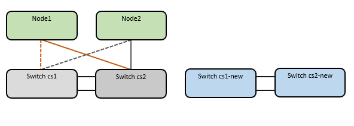
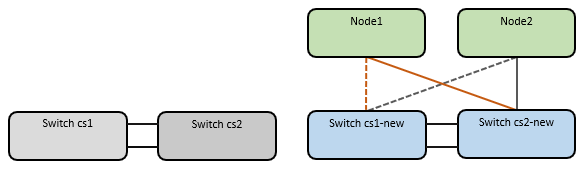

== Review requirements

Ensure that:

* Some of the ports on Nexus 9336C-FX2 switches are configured to run at 10 GbE or 40 GbE.
* The 10 GbE and 40 GbE connectivity from nodes to Nexus 9336C-FX2 cluster switches have been planned, migrated, and documented.
* The cluster is fully functioning (there should be no errors in the logs or similar issues).
* Initial customization of the Cisco Nexus 9336C-FX2 switches is complete, so that:
** 9336C-FX2 switches are running the latest recommended version of software.
** Reference Configuration Files (RCFs) have been applied to the switches.
** Any site customization, such as DNS, NTP, SMTP, SNMP, and SSH, are configured on the new switches.
* You have access to the switch compatibility table on the https://mysupport.netapp.com/site/info/cisco-ethernet-switch[Cisco Ethernet Switches^] page for the supported ONTAP, NX-OS, and RCF versions.
* You have reviewed the appropriate software and upgrade guides available on the Cisco web site for the Cisco switch upgrade and downgrade procedures at https://www.cisco.com/c/en/us/support/switches/nexus-9000-series-switches/series.html[Cisco Nexus 9000 Series Switches Support^] page.

== Migrate the switches

.About the examples
The examples in this procedure use two nodes. These nodes use two 10GbE cluster interconnect ports e0a and e0b. See the https://hwu.netapp.com/[Hardware Universe^] to verify the correct cluster ports on your platforms.

NOTE: The command outputs might vary depending on the different releases of ONTAP.

The examples in this procedure use the following switch and node nomenclature:

* The names of the existing two Cisco switches are *cs1* and *cs2*
* The new Nexus 9336C-FX2 cluster switches are *cs1-new* and *cs2-new*.
* The node names are *node1* and *node2*.
* The cluster LIF names are *node1_clus1* and *node1_clus2* for node 1, and *node2_clus1* and *node2_clus2* for node 2.
* The *cluster1::*>* prompt indicates the name of the cluster.

During this procedure, refer to the following example:

.About this task

The procedure requires the use of both ONTAP commands and https://www.cisco.com/c/en/us/support/switches/nexus-9000-series-switches/series.html[Nexus 9000 Series Switches^] commands; ONTAP commands are used, unless otherwise indicated.

No operational inter-switch link (ISL) is needed during this procedure. This is by design because RCF version changes can affect ISL connectivity temporarily. To ensure non-disruptive cluster operations, the following procedure migrates all of the cluster LIFs to the operational partner switch while performing the steps on the target switch.

=== Step 1: Prepare for migration

. If AutoSupport is enabled on this cluster, suppress automatic case creation by invoking an AutoSupport message: `system node autosupport invoke -node * -type all -message MAINT=xh`
+
where _x_ is the duration of the maintenance window in hours.
+
NOTE: The AutoSupport message notifies technical support of this maintenance task so that automatic case creation is suppressed during the maintenance window.

. Change the privilege level to advanced, entering *y* when prompted to continue: 
+
`set -privilege advanced`
+
The advanced prompt (*>) appears.

=== Step 2: Configure ports and cabling

. On the new switches, confirm that the ISL is cabled and healthy between the switches cs1-new and cs2-new: 
+
`show port-channel summary`
+
.Show example 
[%collapsible]
====
[subs=+quotes]
----
cs1-new# *show port-channel summary*
Flags:  D - Down        P - Up in port-channel (members)
        I - Individual  H - Hot-standby (LACP only)
        s - Suspended   r - Module-removed
        b - BFD Session Wait
        S - Switched    R - Routed
        U - Up (port-channel)
        p - Up in delay-lacp mode (member)
        M - Not in use. Min-links not met
--------------------------------------------------------------------------------
Group Port-       Type     Protocol  Member Ports
      Channel
--------------------------------------------------------------------------------
1     Po1(SU)     Eth      LACP      Eth1/35(P)   Eth1/36(P)

cs2-new# *show port-channel summary*
Flags:  D - Down        P - Up in port-channel (members)
        I - Individual  H - Hot-standby (LACP only)
        s - Suspended   r - Module-removed
        b - BFD Session Wait
        S - Switched    R - Routed
        U - Up (port-channel)
        p - Up in delay-lacp mode (member)
        M - Not in use. Min-links not met
--------------------------------------------------------------------------------
Group Port-       Type     Protocol  Member Ports
      Channel
--------------------------------------------------------------------------------
1     Po1(SU)     Eth      LACP      Eth1/35(P)   Eth1/36(P)
----
====

. Display the cluster ports on each node that are connected to the existing cluster switches: 
+
`network device-discovery show`
+
.Show example 
[%collapsible]
====
[subs=+quotes]
----
cluster1::*> *network device-discovery show -protocol cdp*
Node/       Local  Discovered
Protocol    Port   Device (LLDP: ChassisID)  Interface         Platform
----------- ------ ------------------------- ----------------  ----------------
node1      /cdp
            e0a    cs1                       Ethernet1/1        N5K-C5596UP
            e0b    cs2                       Ethernet1/2        N5K-C5596UP
node2      /cdp
            e0a    cs1                       Ethernet1/1        N5K-C5596UP
            e0b    cs2                       Ethernet1/2        N5K-C5596UP
----
====

. Determine the administrative or operational status for each cluster port.

.. Verify that all the cluster ports are up with a healthy status: 
+
`network port show -ipspace Cluster`
+
.Show example 
[%collapsible]
====
[subs=+quotes]
----
cluster1::*> *network port show -ipspace Cluster*

Node: node1
                                                                       Ignore
                                                  Speed(Mbps) Health   Health
Port      IPspace      Broadcast Domain Link MTU  Admin/Oper  Status   Status
--------- ------------ ---------------- ---- ---- ----------- -------- ------
e0a       Cluster      Cluster          up   9000  auto/10000 healthy  false
e0b       Cluster      Cluster          up   9000  auto/10000 healthy  false

Node: node2
                                                                       Ignore
                                                  Speed(Mbps) Health   Health
Port      IPspace      Broadcast Domain Link MTU  Admin/Oper  Status   Status
--------- ------------ ---------------- ---- ---- ----------- -------- ------
e0a       Cluster      Cluster          up   9000  auto/10000 healthy  false
e0b       Cluster      Cluster          up   9000  auto/10000 healthy  false
----
====

.. Verify that all the cluster interfaces (LIFs) are on their home ports: 
+
`network interface show -vserver Cluster`
+
.Show example 
[%collapsible]
====
[subs=+quotes]
----
cluster1::*> *network interface show -vserver Cluster*

            Logical      Status     Network            Current     Current Is
Vserver     Interface    Admin/Oper Address/Mask       Node        Port    Home
----------- -----------  ---------- ------------------ ----------- ------- ----
Cluster
            node1_clus1  up/up      169.254.209.69/16  node1       e0a     true
            node1_clus2  up/up      169.254.49.125/16  node1       e0b     true
            node2_clus1  up/up      169.254.47.194/16  node2       e0a     true
            node2_clus2  up/up      169.254.19.183/16  node2       e0b     true
----
====

.. Verify that the cluster displays information for both cluster switches: 
+
`system cluster-switch show -is-monitoring-enabled-operational true`
+
.Show example 
[%collapsible]
====
[subs=+quotes]
----
cluster1::*> *system cluster-switch show -is-monitoring-enabled-operational true*
Switch                      Type               Address          Model
--------------------------- ------------------ ---------------- ---------------
cs1                         cluster-network    10.233.205.92    N5K-C5596UP
      Serial Number: FOXXXXXXXGS
       Is Monitored: true
             Reason: None
   Software Version: Cisco Nexus Operating System (NX-OS) Software, Version
                     9.3(4)
     Version Source: CDP

cs2                         cluster-network     10.233.205.93   N5K-C5596UP
      Serial Number: FOXXXXXXXGD
       Is Monitored: true
             Reason: None
   Software Version: Cisco Nexus Operating System (NX-OS) Software, Version
                     9.3(4)
     Version Source: CDP
----
====

. Disable auto-revert on the cluster LIFs.
+
.Show example 
[%collapsible]
====
[subs=+quotes]
----
cluster1::*> *network interface modify -vserver Cluster -lif * -auto-revert false*
----
====

. On cluster switch cs2, shut down the ports connected to the cluster ports of the nodes:
+
.Show example 
[%collapsible]
====
[subs=+quotes]
----
cs2(config)# *interface eth1/1-1/2*
cs2(config-if-range)# *shutdown*
----
====

. Verify that the cluster LIFs have migrated to the ports hosted on cluster switch cs1. This might take a few seconds.
+
`network interface show -vserver Cluster`
+
.Show example 
[%collapsible]
====
[subs=+quotes]
----
cluster1::*> *network interface show -vserver Cluster*
            Logical       Status     Network            Current    Current Is
Vserver     Interface     Admin/Oper Address/Mask       Node       Port    Home
----------- ------------- ---------- ------------------ ---------- ------- ----
Cluster
            node1_clus1   up/up      169.254.3.4/16     node1      e0a     true
            node1_clus2   up/up      169.254.3.5/16     node1      e0a     false
            node2_clus1   up/up      169.254.3.8/16     node2      e0a     true
            node2_clus2   up/up      169.254.3.9/16     node2      e0a     false
----
====

. Verify that the cluster is healthy: 
+
`cluster show`
+
.Show example 
[%collapsible]
====
[subs=+quotes]
----
cluster1::*> cluster show
Node       Health  Eligibility   Epsilon
---------- ------- ------------- -------
node1      true    true          false
node2      true    true          false
----
====

. Move all cluster node connection cables from the old cs2 switch to the new cs2-new switch.
+
*Cluster node connection cables moved to the cs2-new switch*
+
image::../media/new_switch_cs1.png[Cluster node connection cables moved to the cs2-new switch]

. Confirm the health of the network connections moved to cs2-new: 
+
`network port show -ipspace Cluster`
+
.Show example 
[%collapsible]
====
[subs=+quotes]
----
cluster1::*> *network port show -ipspace Cluster*

Node: node1
                                                                       Ignore
                                                  Speed(Mbps) Health   Health
Port      IPspace      Broadcast Domain Link MTU  Admin/Oper  Status   Status
--------- ------------ ---------------- ---- ---- ----------- -------- ------
e0a       Cluster      Cluster          up   9000  auto/10000 healthy  false
e0b       Cluster      Cluster          up   9000  auto/10000 healthy  false

Node: node2
                                                                       Ignore
                                                  Speed(Mbps) Health   Health
Port      IPspace      Broadcast Domain Link MTU  Admin/Oper  Status   Status
--------- ------------ ---------------- ---- ---- ----------- -------- ------
e0a       Cluster      Cluster          up   9000  auto/10000 healthy  false
e0b       Cluster      Cluster          up   9000  auto/10000 healthy  false
----
====
+
All cluster ports that were moved should be up.
+
. Check neighbor information on the cluster ports:
+
`network device-discovery show -protocol cdp`
+
.Show example 
[%collapsible]
====

[subs=+quotes]
----
cluster1::*> *network device-discovery show -protocol cdp*

Node/       Local  Discovered
Protocol    Port   Device (LLDP: ChassisID)  Interface      Platform
----------- ------ ------------------------- -------------  --------------
node1      /cdp
            e0a    cs1                       Ethernet1/1    N5K-C5596UP
            e0b    cs2-new                   Ethernet1/1/1  N9K-C9336C-FX2

node2      /cdp
            e0a    cs1                       Ethernet1/2    N5K-C5596UP
            e0b    cs2-new                   Ethernet1/1/2  N9K-C9336C-FX2
----
====
+
Verify that the moved cluster ports see the cs2-new switch as the neighbor.
+
. Confirm the switch port connections from switch cs2-new’s perspective:
+
[subs=+quotes]
----
cs2-new# *show interface brief*
cs2-new# *show cdp neighbors*
----

. On cluster switch cs1, shut down the ports connected to the cluster ports of the nodes. The following example uses the interface example output from step 7.
+
[subs=+quotes]
----
cs1(config)# *interface eth1/1-1/2*
cs1(config-if-range)# *shutdown*
----
All cluster LIFs will move to the cs2-new switch.

. Verify that the cluster LIFs have migrated to the ports hosted on switch cs2-new. This might take a
few seconds: 
+
`network interface show -vserver Cluster`
+
.Show example 
[%collapsible]
====
[subs=+quotes]
----
cluster1::*> *network interface show -vserver Cluster*
            Logical      Status     Network            Current     Current Is
Vserver     Interfac     Admin/Oper Address/Mask       Node        Port    Home
----------- ------------ ---------- ------------------ ----------- ------- ----
Cluster
            node1_clus1  up/up      169.254.3.4/16     node1       e0b     false
            node1_clus2  up/up      169.254.3.5/16     node1       e0b     true
            node2_clus1  up/up      169.254.3.8/16     node2       e0b     false
            node2_clus2  up/up      169.254.3.9/16     node2       e0b     true
----
====

. Verify that the cluster is healthy: 
+
`cluster show`
+
.Show example 
[%collapsible]
====
[subs=+quotes]
----
cluster1::*> *cluster show*
Node       Health  Eligibility   Epsilon
---------- ------- ------------- -------
node1      true    true          false
node2      true    true          false
----
====

. Move the cluster node connection cables from cs1 to the new cs1-new switch.
+
*Cluster node connection cables moved to the cs1-new switch*
+

. Confirm the health of the network connections moved to cs1-new: 
+
`network port show -ipspace Cluster`
+
.Show example 
[%collapsible]
====
[subs=+quotes]
----
cluster1::*> *network port show -ipspace Cluster*

Node: node1
                                                                       Ignore
                                                  Speed(Mbps) Health   Health
Port      IPspace      Broadcast Domain Link MTU  Admin/Oper  Status   Status
--------- ------------ ---------------- ---- ---- ----------- -------- ------
e0a       Cluster      Cluster          up   9000  auto/10000 healthy  false
e0b       Cluster      Cluster          up   9000  auto/10000 healthy  false

Node: node2
                                                                       Ignore
                                                  Speed(Mbps) Health   Health
Port      IPspace      Broadcast Domain Link MTU  Admin/Oper  Status   Status
--------- ------------ ---------------- ---- ---- ----------- -------- ------
e0a       Cluster      Cluster          up   9000  auto/10000 healthy  false
e0b       Cluster      Cluster          up   9000  auto/10000 healthy  false
----
====
+
All cluster ports that were moved should be up.
+
. Check neighbor information on the cluster ports: 
+
`network device-discovery show`
+
.Show example 
[%collapsible]
====
[subs=+quotes]
----
cluster1::*> *network device-discovery show -protocol cdp*
Node/       Local  Discovered
Protocol    Port   Device (LLDP: ChassisID)  Interface       Platform
----------- ------ ------------------------- --------------  --------------
node1      /cdp
            e0a    cs1-new                   Ethernet1/1/1   N9K-C9336C-FX2
            e0b    cs2-new                   Ethernet1/1/2   N9K-C9336C-FX2

node2      /cdp
            e0a    cs1-new                   Ethernet1/1/1   N9K-C9336C-FX2
            e0b    cs2-new                   Ethernet1/1/2   N9K-C9336C-FX2
----
====
+
Verify that the moved cluster ports see the cs1-new switch as the neighbor.
+
. Confirm the switch port connections from switch cs1-new’s perspective:
+
.Show example 
[%collapsible]
====
[subs=+quotes]
----
cs1-new# *show interface brief*
cs1-new# *show cdp neighbors*
----
====

. Verify that the ISL between cs1-new and cs2-new is still operational: 
+
`show port-channel summary`
+
.Show example 
[%collapsible]
====
[subs=+quotes]
----
cs1-new# *show port-channel summary*
Flags:  D - Down        P - Up in port-channel (members)
        I - Individual  H - Hot-standby (LACP only)
        s - Suspended   r - Module-removed
        b - BFD Session Wait
        S - Switched    R - Routed
        U - Up (port-channel)
        p - Up in delay-lacp mode (member)
        M - Not in use. Min-links not met
--------------------------------------------------------------------------------
Group Port-       Type     Protocol  Member Ports
      Channel
--------------------------------------------------------------------------------
1     Po1(SU)     Eth      LACP      Eth1/35(P)   Eth1/36(P)

cs2-new# *show port-channel summary*
Flags:  D - Down        P - Up in port-channel (members)
        I - Individual  H - Hot-standby (LACP only)
        s - Suspended   r - Module-removed
        b - BFD Session Wait
        S - Switched    R - Routed
        U - Up (port-channel)
        p - Up in delay-lacp mode (member)
        M - Not in use. Min-links not met
--------------------------------------------------------------------------------
Group Port-       Type     Protocol  Member Ports
      Channel
--------------------------------------------------------------------------------
1     Po1(SU)     Eth      LACP      Eth1/35(P)   Eth1/36(P)
----
====

=== Step 3: Verify the configuration

. Enable auto-revert on the cluster LIFs.
+
.Show example 
[%collapsible]
====
[subs=+quotes]
----
cluster1::*> *network interface modify -vserver Cluster -lif * -auto-revert true*
----
====

. Verify that the cluster LIFs have reverted to their home ports (this might take a minute):
+
`network interface show -vserver Cluster`
+
If the cluster LIFs have not reverted to their home port, manually revert them: 
+
`network interface revert -vserver Cluster -lif *`

. Verify that the cluster is healthy: 
+
`cluster show`

. Verify connectivity for the remote cluster interfaces: 
+
// start of tabbed content

[role="tabbed-block"]

====
.ONTAP 9.9.1 and later
--
Beginning with ONTAP 9.9.1 and later, use the `network interface check cluster-connectivity` command to start the check and display the details: 
+
`network interface check cluster-connectivity start -node *` and
+
`network interface check cluster-connectivity show`
+
.Show example 
[%collapsible]
====
[subs=+quotes]
----
cluster1::*>*network interface check cluster-connectivity start -node *
----

*NOTE:* Wait for a number of seconds before running the show command to check the results.

+
[subs=+quotes]
----
cluster1::*> *network interface check cluster-connectivity show*
                                  Source          Destination     Packet
Node   Date                       LIF             LIF             Loss
------ -------------------------- --------------- --------------- -----------
cluster1-01
       3/5/2022 19:21:18 -06:00   cluster1-01_clus2 cluster1-02_clus1 none
       3/5/2022 19:21:20 -06:00   cluster1-01_clus2 cluster1-02_clus2 none
----
--

.ONTAP releases 9.5P16, 9.6P12, and 9.7P10 and later patch releases
--
For earlier ONTAP releases, use the `cluster ping-cluster -node <name>` command:
+
`cluster ping-cluster -node <name>`
+
.Show example 
[%collapsible]
====
[subs=+quotes]
----
cluster1::*> *cluster ping-cluster -node node2*
Host is node2
Getting addresses from network interface table...
Cluster node1_clus1 169.254.209.69 node1     e0a
Cluster node1_clus2 169.254.49.125 node1     e0b
Cluster node2_clus1 169.254.47.194 node2     e0a
Cluster node2_clus2 169.254.19.183 node2     e0b
Local = 169.254.47.194 169.254.19.183
Remote = 169.254.209.69 169.254.49.125
Cluster Vserver Id = 4294967293
Ping status:
....
Basic connectivity succeeds on 4 path(s)
Basic connectivity fails on 0 path(s)
................
Detected 9000 byte MTU on 4 path(s):
    Local 169.254.19.183 to Remote 169.254.209.69
    Local 169.254.19.183 to Remote 169.254.49.125
    Local 169.254.47.194 to Remote 169.254.209.69
    Local 169.254.47.194 to Remote 169.254.49.125
Larger than PMTU communication succeeds on 4 path(s)
RPC status:
2 paths up, 0 paths down (tcp check)
2 paths up, 0 paths down (udp check)
----
====
--
====

. Enable the Ethernet switch health monitor log collection feature for collecting switch-related log files.
+
// start of tabbed content

[role="tabbed-block"]

====
.ONTAP 9.8 and later
--
Enable the Ethernet switch health monitor log collection feature for collecting switch-related log files, using the following two commands: `system switch ethernet log setup-password` and `system switch ethernet log enable-collection`

*NOTE:* You will need the password for the *admin* user on the switches.

Enter: `system switch ethernet log setup-password`

[subs=+quotes]
----
cluster1::*> *system switch ethernet log setup-password*
Enter the switch name: <return>
The switch name entered is not recognized.
Choose from the following list:
cs1-new
cs2-new

cluster1::*> *system switch ethernet log setup-password*

Enter the switch name: *cs1-new*
RSA key fingerprint is e5:8b:c6:dc:e2:18:18:09:36:63:d9:63:dd:03:d9:cc
Do you want to continue? {y|n}::[n] *y*

Enter the password: <password of switch's admin user>
Enter the password again: <password of switch's admin user>

cluster1::*> *system switch ethernet log setup-password*

Enter the switch name: *cs2-new*
RSA key fingerprint is 57:49:86:a1:b9:80:6a:61:9a:86:8e:3c:e3:b7:1f:b1
Do you want to continue? {y|n}:: [n] *y*

Enter the password: <password of switch's admin user>
Enter the password again: <password of switch's admin user>
----
Followed by: `system switch ethernet log enable-collection`

[subs=+quotes]
----
cluster1::*> *system  switch ethernet log enable-collection*

Do you want to enable cluster log collection for all nodes in the cluster?
{y|n}: [n] *y*

Enabling cluster switch log collection.

cluster1::*>
----

*NOTE:* If any of these commands return an error, contact NetApp support.

--

.ONTAP releases 9.5P16, 9.6P12, and 9.7P10 and later patch releases

--
Enable the Ethernet switch health monitor log collection feature for collecting switch-related log files, using the commands: `system cluster-switch log setup-password` and `system cluster-switch log enable-collection`

*NOTE:* You will need the password for the *admin* user on the switches.

Enter: `system cluster-switch log setup-password`

[subs=+quotes]
----
cluster1::*> *system cluster-switch log setup-password*
Enter the switch name: <return>
The switch name entered is not recognized.
Choose from the following list:
cs1-new
cs2-new

cluster1::*> *system cluster-switch log setup-password*

Enter the switch name: *cs1-new*
RSA key fingerprint is e5:8b:c6:dc:e2:18:18:09:36:63:d9:63:dd:03:d9:cc
Do you want to continue? {y|n}::[n] *y*

Enter the password: <password of switch's admin user>
Enter the password again: <password of switch's admin user>

cluster1::*> *system cluster-switch log setup-password*

Enter the switch name: *cs2-new*
RSA key fingerprint is 57:49:86:a1:b9:80:6a:61:9a:86:8e:3c:e3:b7:1f:b1
Do you want to continue? {y|n}:: [n] *y*

Enter the password: <password of switch's admin user>
Enter the password again: <password of switch's admin user>
----

Followed by: `system cluster-switch log enable-collection`

[subs=+quotes]
----
cluster1::*> *system cluster-switch log enable-collection*

Do you want to enable cluster log collection for all nodes in the cluster?
{y|n}: [n] *y*

Enabling cluster switch log collection.

cluster1::*>
----

*NOTE:* If any of these commands return an error, contact NetApp support.
--
====

[start=6]
. [[step6]]If you suppressed automatic case creation, reenable it by invoking an AutoSupport message: `system node autosupport invoke -node * -type all -message MAINT=END`

// Updates for AFFFASDOC-45, 2023-MAY-09

//Updates for GH #112, 2023-JUL-19
