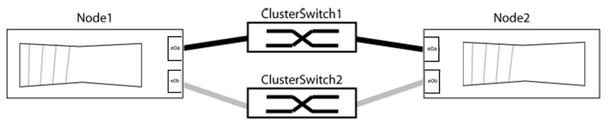
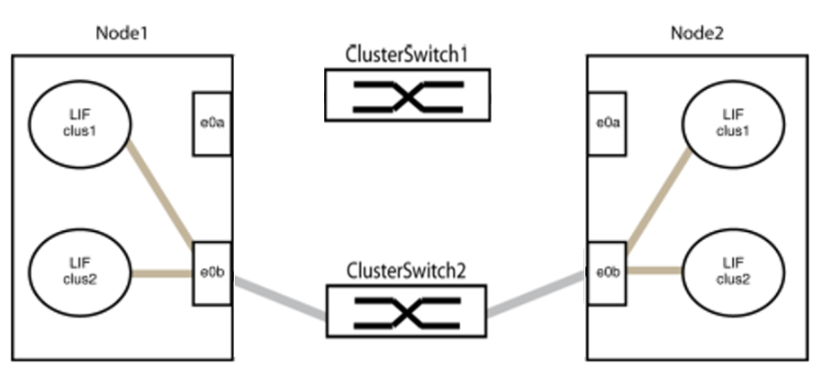
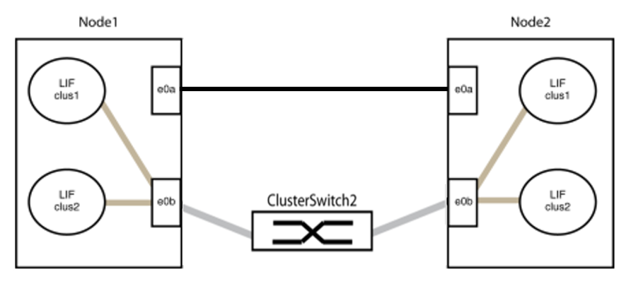
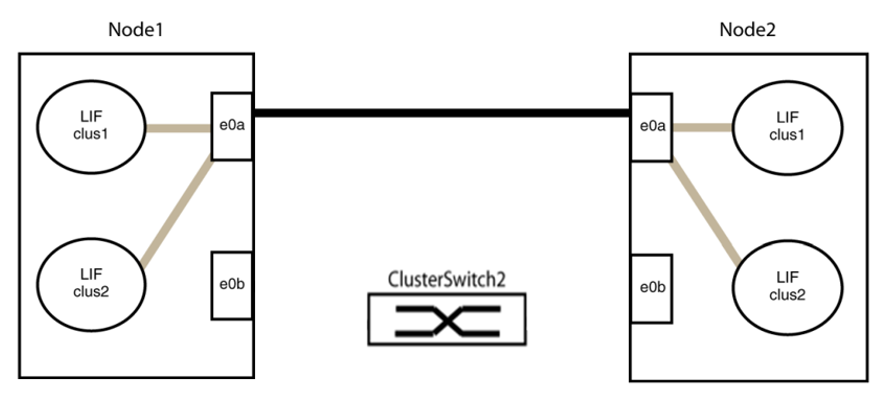
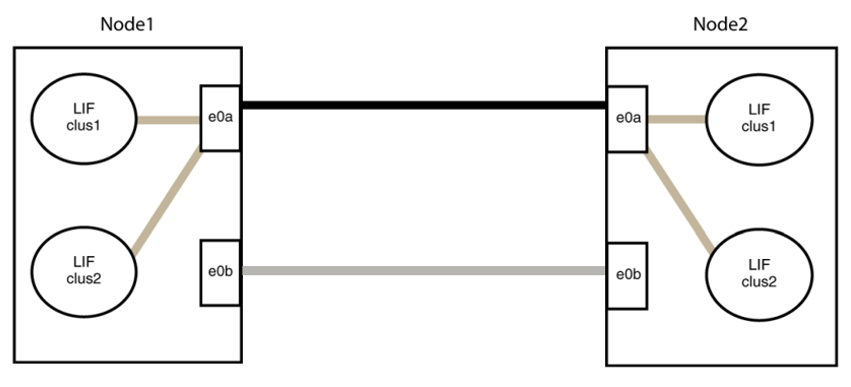

= Replace the switches with direct connections
:icons: font
:imagesdir: ../media/

If you have a two-node cluster that uses cluster interconnect switches, replace the switches with direct, back-to-back connections between the nodes. This is a nondisruptive operation.

.Before you begin

* The cluster must be healthy and consist of two nodes connected by cluster switches, and the nodes must be running the same ONTAP release.
* Each node must have the required number of dedicated cluster ports that provide redundant cluster interconnect connections to support your system configuration, for example, two redundant ports for a system with two dedicated cluster interconnect ports on each node.

.About this task
The following procedure removes the cluster switches in a two-node cluster and replaces each connection to the switch with a direct connection to the partner node.

image::../media/tnsc_clusterswitches_and_direct_connections.PNG[Cluster switches replaced with direct connections]

The examples in the following procedure show nodes that are using "e0a" and "e0b" as cluster ports. Your nodes might be using different cluster ports as they vary by system.

.Steps
.	Change the privilege level to advanced, entering `y` when prompted to continue:
+
`set -privilege advanced`
+
The advanced prompt `*>` appears.

. ONTAP 9.3 and later supports automatic detection of switchless clusters, which is enabled by default.
+
You can verify that detection of switchless clusters is enabled by running the advanced privilege command:
+
`network options detect-switchless-cluster show`
+
The following example output shows if the option is enabled.
+
----
cluster::*> network options detect-switchless-cluster show
   (network options detect-switchless-cluster show)
Enable Switchless Cluster Detection: true
----
+
If "Enable Switchless Cluster Detection” is `false`, contact support.

.	If AutoSupport is enabled on this cluster, suppress automatic case creation by invoking an AutoSupport message:
+
`system node autosupport invoke -node * -type all -message MAINT=<number_of_hours>h`
+
where `h` is the duration of the maintenance window in hours. The message notifies technical support of this maintenance task so that they can suppress automatic case creation during the maintenance window.
+
In the following example, the command suppresses automatic case creation for two hours:
+
----
cluster::*> system node autosupport invoke -node * -type all -message MAINT=2h
----

.	Organize the cluster ports on each switch into groups so that the cluster ports in group1 go to cluster switch1 and the cluster ports in group2 go to cluster switch2. These groups are required later in the procedure.
.	Identify the cluster ports and verify link status and health:
+
`network port show -ipspace Cluster`
+
In the following example for nodes with cluster ports "e0a" and "e0b", one group is identified as “node1:e0a” and “node2:e0a” and the other group as “node1:e0b” and “node2:e0b”. Your nodes might be using different cluster ports because they vary by system.
+

+
Verify that the ports have a value of `up` for the “Link” column and a value of `healthy` for the “Health Status” column, as shown in the following example:
+
----
cluster::> network port show -ipspace Cluster
Node: node1
                                                                 Ignore
                                             Speed(Mbps) Health  Health
Port  IPspace   Broadcast Domain Link  MTU   Admin/Oper	 Status  Status
----- --------- ---------------- ----- ----- ----------- ------- -------
e0a   Cluster   Cluster          up    9000  auto/10000  healthy false
e0b   Cluster   Cluster          up    9000  auto/10000  healthy false

Node: node2
                                                                 Ignore
                                             Speed(Mbps) Health  Health
Port  IPspace   Broadcast Domain Link  MTU   Admin/Oper	 Status  Status
----- --------- ---------------- ----- ----- ----------- ------- -------
e0a   Cluster   Cluster          up    9000  auto/10000  healthy false
e0b   Cluster   Cluster          up    9000  auto/10000  healthy false
4 entries were displayed.
----

.	Confirm that all the cluster LIFs are on their home ports.
+
Verify that the “is-home” column is `true` for each of the cluster LIFs:
+
`network interface show -vserver Cluster -fields is-home`
+
The system displays output similar to the following example:
+
----
cluster::*> net int show -vserver Cluster -fields is-home
(network interface show)
vserver  lif          is-home
-------- ------------ --------
Cluster  node1_clus1  true
Cluster  node1_clus2  true
Cluster  node2_clus1  true
Cluster  node2_clus2  true
4 entries were displayed.
----
+
If there are cluster LIFs that are not on their home ports, revert those LIFs to their home ports:
+
`network interface revert -vserver Cluster -lif *`
.	Disable auto-revert for the cluster LIFs:
+
`network interface modify -vserver Cluster -lif * -auto-revert false`

. Verify that all ports listed in the previous step are connected to a network switch:
+
`network device-discovery show -port _cluster_port_`
+
The “Discovered Device” column should be the name of the cluster switch that the port is connected to. The following example shows that cluster ports "e0a" and "e0b" are correctly connected to cluster switches "cs1" and "cs2".
+
----
cluster::> network device-discovery show -port e0a|e0b
  (network device-discovery show)
Node/     Local  Discovered
Protocol  Port   Device (LLDP: ChassisID)  Interface  Platform
--------- ------ ------------------------- ---------- ----------
node1/cdp
          e0a    cs1                       0/11       BES-53248
          e0b    cs2                       0/12       BES-53248
node2/cdp
          e0a    cs1                       0/9        BES-53248
          e0b    cs2                       0/9        BES-53248
4 entries were displayed.
----

.	Verify the cluster connectivity:
+
`cluster ping-cluster -node local`
.	Verify that the cluster is healthy:
+
`cluster ring show`
+
All units must be either master or secondary.
.	Set up the switchless configuration for the ports in group 1.
+
IMPORTANT: To avoid potential networking issues, you must disconnect the ports from group1 and reconnect them back-to-back as quickly as possible, for example, *in less than 20 seconds*.

..	Disconnect all the cables from the ports in group1 at the same time.
+
In the following example, the cables are disconnected from port "e0a" on each node, and cluster traffic continues through the switch and port "e0b" on each node:
+

..	Cable the ports in group1 back-to-back.
+
In the following example, "e0a" on node1 is connected to "e0a" on node2:
+

.	The switchless cluster network option transitions from `false` to `true`. This might take up to 45 seconds. Confirm that the switchless option is set to `true`:
+
`network options switchless-cluster show`
+
The following example shows that the switchless cluster is enabled:
+
----
cluster::*> network options switchless-cluster show
Enable Switchless Cluster: true
----

.	Verify that the cluster network is not disrupted:
+
`cluster ping-cluster -node local`
+
IMPORTANT: Before proceeding to the next step, you must wait at least two minutes to confirm a working back-to-back connection on group 1.

.	Set up the switchless configuration for the ports in group 2.
+
IMPORTANT: To avoid potential networking issues, you must disconnect the ports from group2 and reconnect them back-to-back as quickly as possible, for example, *in less than 20 seconds*.

..	Disconnect all the cables from the ports in group2 at the same time.
+
In the following example, the cables are disconnected from port "e0b" on each node, and cluster traffic continues through the direct connection between the "e0a" ports:
+

..	Cable the ports in group2 back-to-back.
+
In the following example, "e0a" on node1 is connected to "e0a" on node2 and "e0b" on node1 is connected to "e0b" on node2:
+

.	Verify that the ports on both nodes are correctly connected:
+
`network device-discovery show -port _cluster_port_`
+
The following example shows that cluster ports "e0a" and "e0b" are correctly connected to the corresponding port on the cluster partner:
+
----
cluster::> net device-discovery show -port e0a|e0b
  (network device-discovery show)
Node/      Local  Discovered
Protocol   Port   Device (LLDP: ChassisID)  Interface  Platform
---------- ------ ------------------------- ---------- ----------
node1/cdp
           e0a    node2                     e0a        AFF-A300
           e0b    node2                     e0b        AFF-A300
node1/lldp
           e0a    node2 (00:a0:98:da:16:44) e0a        -
           e0b    node2 (00:a0:98:da:16:44) e0b        -
node2/cdp
           e0a    node1                     e0a        AFF-A300
           e0b    node1                     e0b        AFF-A300
node2/lldp
           e0a    node1 (00:a0:98:da:87:49) e0a        -
           e0b    node1 (00:a0:98:da:87:49) e0b        -
8 entries were displayed.
----

.	Reenable auto-revert for the cluster LIFs:
+
`network interface modify -vserver Cluster -lif * -auto-revert true`

.	Verify that all LIFs are home. This might take a few seconds:
+
`network interface show -vserver Cluster -lif _lif_name_`
+
The LIFs have been reverted if the “Is Home” column is `true`, as shown for `node1_clus2` and `node2_clus2` in the following example:
+
----
cluster::> network interface show -vserver Cluster -fields curr-port,is-home
vserver  lif           curr-port is-home
-------- ------------- --------- -------
Cluster  node1_clus1   e0a       true
Cluster  node1_clus2   e0b       true
Cluster  node2_clus1   e0a       true
Cluster  node2_clus2   e0b       true
4 entries were displayed.
----
+
If any cluster LIFS have not returned to their home ports, revert them manually:
+
`network interface revert -vserver Cluster -lif _lif_name_`

.	Check the cluster status of the nodes from the system console of either node:
+
`cluster show`
+
The following example shows epsilon on both nodes to be `false`:
+
----
Node  Health  Eligibility Epsilon
----- ------- ----------- --------
node1 true    true        false
node2 true    true        false
2 entries were displayed.
----

.	Confirm connectivity between the cluster ports:
+
`cluster ping-cluster local`

.	If you suppressed automatic case creation, reenable it by invoking an AutoSupport message:
+
`system node autosupport invoke -node * -type all -message MAINT=END`

.	Change the privilege level back to admin:
+
`set -privilege admin`

*Related information*

link:https://kb.netapp.com/Advice_and_Troubleshooting/Data_Storage_Software/ONTAP_OS/How_to_suppress_automatic_case_creation_during_scheduled_maintenance_windows_-_ONTAP_9[NetApp KB Article 1010449: How to suppress automatic case creation during scheduled maintenance windows^]
