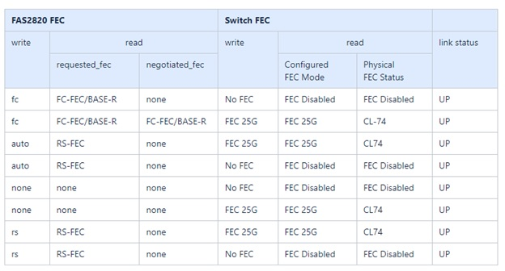
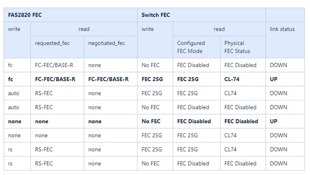

= Review cabling and configuration considerations
:icons: font
:imagesdir: ../media/

[.lead]
Before configuring your Broadcom BES-53248 switch, review the following considerations. 

== Cluster port switch assignments

You can use the Broadcom-supported BES-53248 cluster switch port assignments table as a guide to configuring 
your cluster.

|===

h| *Switch ports* h| *Ports usage* 
a| 0-16
a| 10/25GbE cluster port nodes, base configuration
a| 17-48
a| 10/25GbE cluster port nodes, with licenses
a| 49-54	
a| 40/100GbE cluster port nodes, with licenses, added right to left
a| 55-56
a| 100GbE cluster Inter-Switch Link (ISL) ports, base configuration 
	
|===

See the https://hwu.netapp.com/Switch/Index[Hardware Universe^] for more information on switch ports.
	
== Port group speed constraint
* On BES-53248 cluster switches, the 48 10/25GbE (SFP28/SFP+) ports are combined into 12 x 4-port groups as follows: Ports 1-4, 5-8, 9-12, 13-16, 17-20, 21-24, 25-28, 29-32, 33-36, 37-40, 41-44, and 45-48.
* The SFP28/SFP+ port speed must be the same (10GbE or 25GbE) across all ports in the 4-port group.
* If speeds in a 4-port group are different, the switch ports will not operate correctly.

== FEC requirements

* For 25G ports with copper cables, see the following table for details.
+
If the Controller side is `auto`, the switch side is set to FEC 25G.

* For 25G ports with Fiber/Optical cables, see the following table for details:

=== Bootarg implementation

Use the following command to set the 25G port FEC to either `auto` or `fc`, as required:
----
systemshell -node <node> -command sudo sysctl dev.ice.<X>.requested_fec=<auto/fc>
----

* When set to *`auto`*:
** The `auto` setting propagates the setting to hardware immediately and no reboot is required.
** If `bootarg.cpk_fec_fc_eXx already exists`, it is deleted from the bootarg storage.
** After a reboot, the `auto` setting remains in place since `auto` is the default FEC setting.

* When set to *`fc`*:
** The `FC-FEC` setting propagates the setting to the hardware immediately and no reboot is required.
** A new `bootarg.cpk_fec_fc_eXx` is created with the value set to "true".
** After a reboot, `FC-FEC` setting remains in place for the driver code to use.

// New content for AFFFASDOC-193, 2024-MAR-06