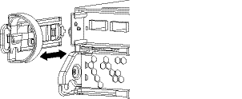
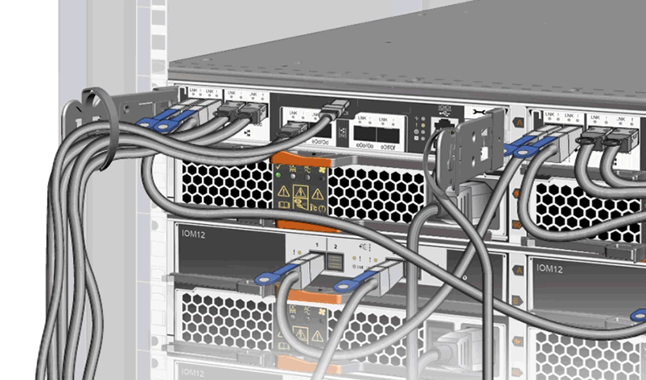
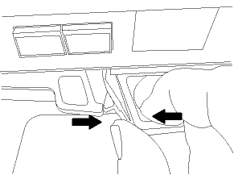
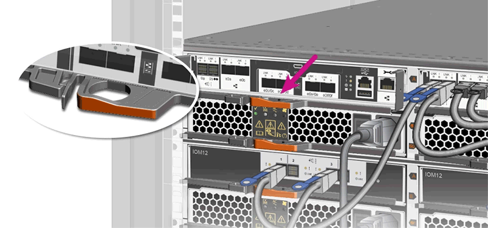
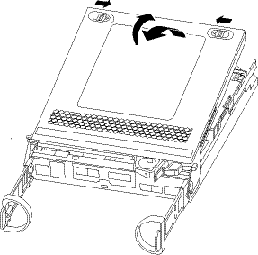
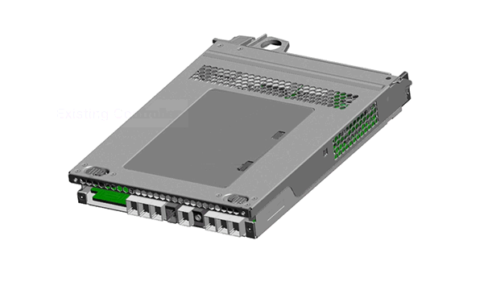
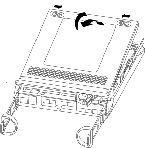

= graphics test
:icons: font
:imagesdir: ../media/

Remove and set aside the cable management devices from the left and right sides of the controller module.

== drw-25xx_cable_management_arm_COLE.svg (commented out after build failure)

// image:../media/drw-25xx_cable_management_arm_COLE.svg[]

== TEST ICON CAPTURE

== PNG

== GIF

== SVG
image::../media/test_drw_25xx_cable_management_arm.svg[]

== PNG

== GIF

== SVG

Turn the controller module over and place it on a flat, stable surface.
Open the cover by sliding in the blue tabs to release the cover, and then swing the cover up and open.

== PNG

== GIF (animated)

== SVG

== test_legend_icon gif
image:../media/test_legend_icon_01.gif[]

image:../media/test_legend_icon_02.gif[]

= test_legend_icon svg
image:../media/test_legend_icon_01.svg[]

image:../media/test_legend_icon_02.svg[]
