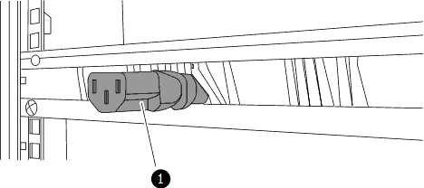
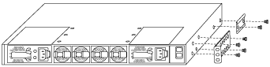
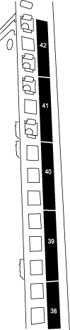
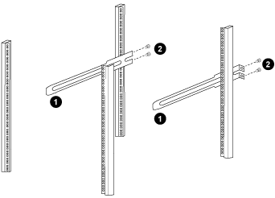
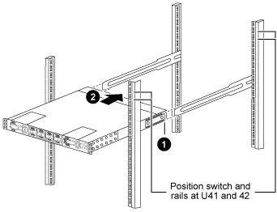
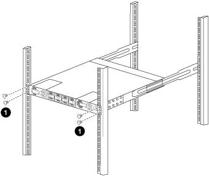

= Install a Cisco Nexus 9336C-FX2 switch and pass-through panel in a NetApp cabinet
:icons: font
:imagesdir: ../media/

[.lead]
You can install the Cisco Nexus 9336C-FX2 switch and pass-through panel in a NetApp cabinet with the standard brackets that are included with the switch.

.About this task
You must have reviewed the initial preparation requirements, kit contents, and safety precautions.

https://www.cisco.com/c/en/us/td/docs/switches/datacenter/nexus9000/hw/aci_9336cfx2_hig/guide/b_n9336cFX2_aci_hardware_installation_guide.html[Cisco Nexus 9000 Series Hardware Installation Guide]

* For each switch, you must supply the eight 10-32 or 12-24 screws and clip nuts to mount the brackets and slider rails to the front and rear cabinet posts.
* You must use the Cisco standard rail kit to install the switch in a NetApp cabinet.

NOTE: The jumper cords are not included with the pass-through kit and should be included with your switches. If they were not shipped with the switches, you can order them from NetApp (part number X1558A-R6).

.Steps
. Install the pass-through blanking panel in the NetApp cabinet.
+
The pass-through panel kit is available from NetApp (part number X8784-R6).
+
The NetApp pass-through panel kit contains the following hardware:

 ** One pass-through blanking panel
 ** Four 10-32 x .75 screws
 ** Four 10-32 clip nuts

 .. Determine the vertical location of the switches and blanking panel in the cabinet.
+
In this procedure, the blanking panel will be installed in U40.

 .. Install two clip nuts on each side in the appropriate square holes for front cabinet rails.
 .. Center the panel vertically to prevent intrusion into adjacent rack space, and then tighten the screws.
 .. Insert the female connectors of both 48-inch jumper cords from the rear of the panel and through the brush assembly.
+

  ... Female connector of the jumper cord.

. Install the rack-mount brackets on the Nexus 9336C-FX2 switch chassis.
 .. Position a front rack-mount bracket on one side of the switch chassis so that the mounting ear is aligned with the chassis faceplate (on the PSU or fan side), and then use four M4 screws to attach the bracket to the chassis.
+

 .. Repeat step <<SUBSTEP_9F2E2DDAEE084FE5853D1A6C6D945941,2a>> with the other front rack-mount bracket on the other side of the switch.
 .. Install the rear rack-mount bracket on the switch chassis.
 .. Repeat step <<SUBSTEP_53A502380D6D4F058F62ED5ED5FC2000,2c>> with the other rear rack-mount bracket on the other side of the switch.
. Install the clip nuts in the square hole locations for all four IEA posts.
+

+
The two 9336C-FX2 switches will always be mounted in the top 2U of the cabinet RU41 and 42.

. Install the slider rails in the cabinet.
 .. Position the first slider rail at the RU42 mark on the back side of the rear left post, insert screws with the matching thread type, and then tighten the screws with your fingers.
+

  ... As you gently slide the slider rail, align it to the screw holes in the rack.
  ... Tighten the screws of the slider rails to the cabinet posts.

 .. Repeat step <<SUBSTEP_81651316D3F84964A76BC80A9DE48C0E,4a>> for the right side rear post.
 .. Repeat steps <<SUBSTEP_81651316D3F84964A76BC80A9DE48C0E,4a>> and <<SUBSTEP_593967A423024594B9A41A04703DC458,4b>> at the RU41 locations on the cabinet.
. Install the switch in the cabinet.
+
NOTE: This step requires two people: one person to support the switch from the front and another to guide the switch into the rear slider rails.

 .. Position the back of the switch at RU41.
+

  ... As the chassis is pushed toward the rear posts, align the two rear rack-mount guides with the slider rails.
  ... Gently slide the switch until the front rack-mount brackets are flush with the front posts.

 .. Attach the switch to the cabinet.
+

  ... With one person holding the front of the chassis level, the other person should fully tighten the four rear screws to the cabinet posts.

 .. With the chassis now supported without assistance, fully tighten the front screws to the posts.
 .. Repeat steps <<SUBSTEP_4F538C8C55E34C5FB5D348391088A0FE,5a>> through <<SUBSTEP_EB8FE2FED2CA4120B709CC753C0F50FC,5c>> for the second switch at the RU42 location.
+
NOTE: By using the fully installed switch as a support, it is not necessary to hold the front of the second switch during the installation process.

. When the switches are installed, connect the jumper cords to the switch power inlets.
. Connect the male plugs of both jumper cords to the closest available PDU outlets.
+
NOTE: To maintain redundancy, the two cords must be connected to different PDUs.

. Connect the management port on each 9336C-FX2 switch to either of the management switches (if ordered) or connect them directly to your management network.
+
The management port is the upper-right port located on the PSU side of the switch. The CAT6 cable for each switch needs to be routed through the pass-through panel after the switches are installed to connect to the management switches or management network.
