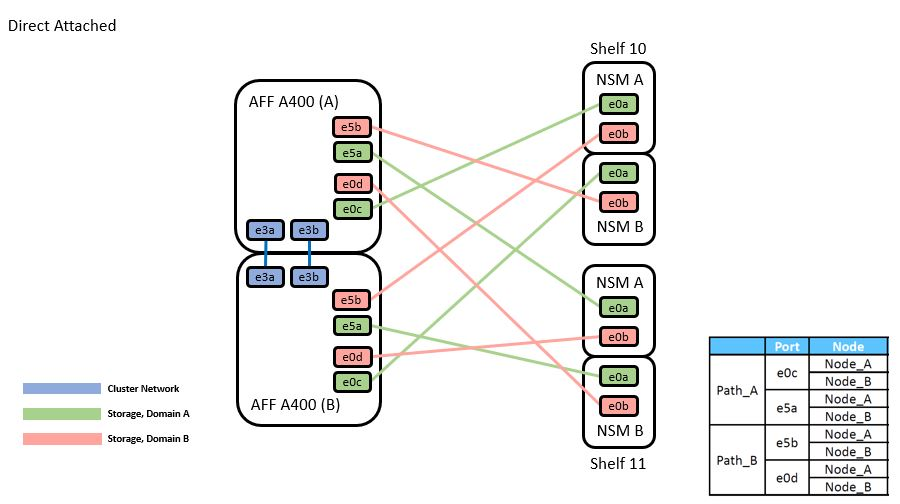
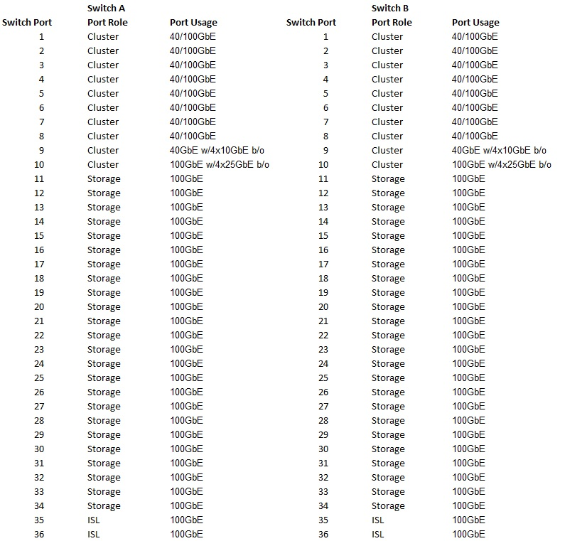
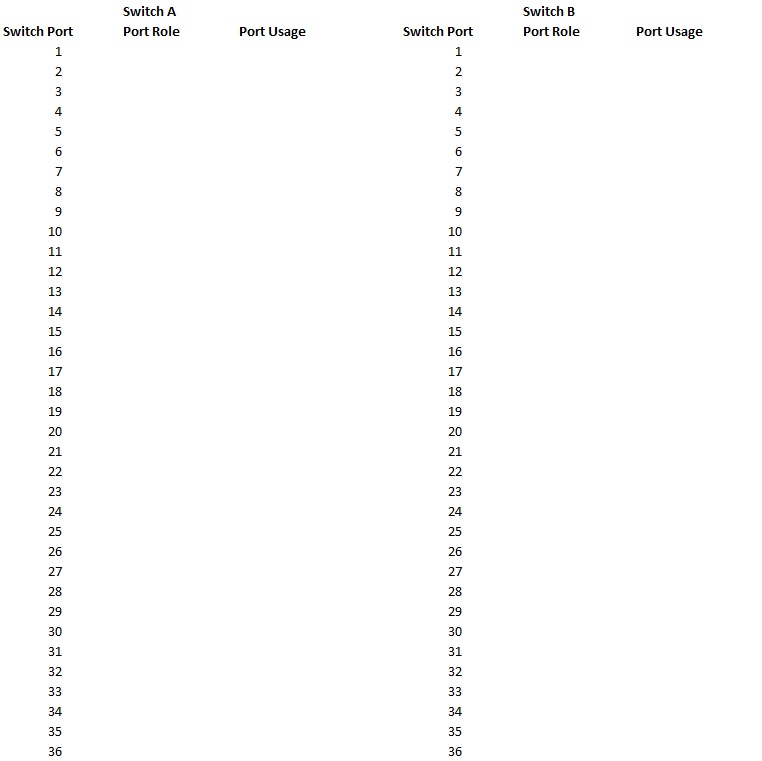

= Complete the Cisco Nexus 9336C-FX2 cabling worksheet
:hardbreaks:
:nofooter:
:icons: font
:linkattrs:
:imagesdir: ../media/

[.lead]
Use the following cabling images to complete the cabling between the controllers and the switches.

== Cable NS224 storage as switch-attached
If you want to cable NS224 storage as switch-attached, follow the switch-attached diagram:
// andris /ontap-systems-switches/pull/30

image::../media/9336c_image1.jpg[Switch-attached]

See the https://hwu.netapp.com/Switch/Index[Hardware Universe] for more information on switch ports.

== Cable NS224 storage as direct-attached
If you want to cable NS224 storage as direct-attached instead of using the shared switch storage ports, follow the direct-attached diagram:
// andris /ontap-systems-switches/pull/30

See the https://hwu.netapp.com/Switch/Index[Hardware Universe] for more information on switch ports.

== Cisco Nexus 9336C-FX2 cabling worksheet

If you want to document the supported platforms, you must complete the blank cabling worksheet by using completed sample cabling worksheet as a guide.

The sample port definition on each pair of switches is as follows:

Where:

* 100G ISL to switch A port 35
* 100G ISL to switch A port 36
* 100G ISL to switch B port 35
* 100G ISL to switch B port 36

== Blank cabling worksheet

You can use the blank cabling worksheet to document the platforms that are supported as nodes in a cluster. The Supported Cluster Connections table of the Hardware Universe defines the cluster ports used by the platform.

Where:

* 100G ISL to switch A port 35
* 100G ISL to switch A port 36
* 100G ISL to switch B port 35
* 100G ISL to switch B port 36
