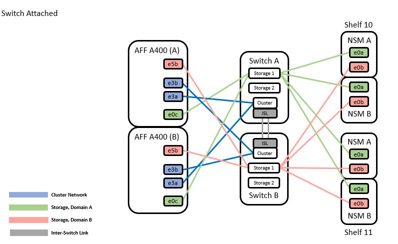

= Migrate from a switchless configuration with SAT storage by reusing the storage switches
:hardbreaks:
:nofooter:
:icons: font
:linkattrs:
:imagesdir: ./media/

//
// This file was created with NDAC Version 2.0 (August 17, 2020)
//
// 2021-04-29 11:40:03.850894
//

== Migrate the storage switches

By reusing the storage switches the storage switches of HA pair 1 become the shared switches.
*Cabling diagram for switch-attached*

.Steps

. Verify that the storage configuration of HA pair 1 (and HA pair 2) is correct and error free:
`system switch ethernet show`

----
storage::*> system switch ethernet show
Switch                    Type                  Address          Model
------------------------- --------------------- ---------------- ----------
sh1
                          storage-network       172.17.227.5     C9336C

    Serial Number: FOC221206C2
     Is Monitored: true
           Reason: none
 Software Version: Cisco Nexus Operating System (NX-OS) Software, Version
                   9.3(5)
   Version Source: CDP
sh2
                        storage-network        172.17.227.6      C9336C
    Serial Number: FOC220443LZ
     Is Monitored: true
           Reason: None
 Software Version: Cisco Nexus Operating System (NX-OS) Software, Version
                   9.3(5)
   Version Source: CDP
2 entries were displayed.
storage::*>
----
[start=2]
. [[step2]]Verify that the node ports are healthy and operational:
`storage port show -port-type ENET`
----
storage::*> storage port show -port-type ENET
                                   Speed                          VLAN
Node    Port    Type    Mode       (Gb/s)    State     Status       ID
------- ------- ------- ---------- --------- --------- --------- -----
node1
        e0c     ENET    storage          100 enabled   online       30
        e0d     ENET    storage          100 enabled   online       30
        e5a     ENET    storage          100 enabled   online       30
        e5b     ENET    storage          100 enabled   online       30

node2
        e0c     ENET    storage          100 enabled   online       30
        e0d     ENET    storage          100 enabled   online       30
        e5a     ENET    storage          100 enabled   online       30
        e5b     ENET    storage          100 enabled   online       30
----
[start=3]
. [[step3]]Move the HA pair 1, NSM224 path A cables from storage switch A to the shared NS224 storage ports for HA pair 1, path A on storage switch A.
. Move the cable from HA pair 1, node A, path A to the shared storage port for HA pair 1, node A on storage switch A.
. Move the cable from HA pair 1, node B, path A to the shared storage port for HA pair 1, node B on storage switch A.
. Verify the storage attached to HA pair 1, storage switch A is healthy:
`system health alert show -instance`
----
storage::*> system health alert show -instance
There are no entries matching your query.
----
[start=7]
. [[step7]]Replace the storage RCF on shared switch A with the shared RCF file. See http://9336c_install_nx-os_software_and_reference_configuration_files_@rcfs@.html#install-the-rcf-on-a-cisco-nexus-9336c-fx2-shared-switch[Install the RCF on a Cisco Nexus 9336C-FX2 shared switch] for further details.
. Verify the storage attached to HA pair 1, storage switch B is healthy:
`system health alert show -instance`
----
storage::*> system health alert show -instance
There are no entries matching your query.
----
[start=9]
. [[step9]]Move the HA pair 1, NSM224 path B cables from storage switch B to the shared NS224 storage ports for HA pair 1, path B to storage switch B.
. Move the cable from HA pair 1, node A, path B to the shared storage port for HA pair 1, node A, path B on storage switch B.
. Move the cable from HA pair 1, node B, path B to the shared storage port for HA pair 1, node B, path B on storage switch B.
. Verify the storage attached to HA pair 1, storage switch B is healthy:
`system health alert show -instance`

----
storage::*> system health alert show -instance
There are no entries matching your query.
----
[start=13]
. [[step13]]Replace the storage RCF file on shared switch B with the shared RCF file. See link:9336c_install_nx-os_software_and_reference_configuration_files_@rcfs@.html#install-the-rcf-on-a-cisco-nexus-9336c-fx2-shared-switch[Install the RCF on a Cisco Nexus 9336C-FX2 shared switch] for further details.
. Verify the storage attached to HA pair 1, storage switch B is healthy:
`system health alert show -instance`

----
storage::*> system health alert show -instance
There are no entries matching your query.
----
[start=15]
. [[step15]]Install the ISLs between shared switch A and shared switch B:

----
sh1# configure
Enter configuration commands, one per line. End with CNTL/Z.
sh1 (config)# interface e1/35-36
sh1 (config-if-range)# no lldp transmit
sh1 (config-if-range)# no lldp receive
sh1 (config-if-range)# switchport mode trunk
sh1 (config-if-range)# no spanning-tree bpduguard enable
sh1 (config-if-range)# channel-group 101 mode active
sh1 (config-if-range)# exit
sh1 (config)# interface port-channel 101
sh1 (config-if)# switchport mode trunk
sh1 (config-if)# spanning-tree port type network
sh1 (config-if)# exit
sh1 (config)# exit
----
[start=16]
. [[step16]]Convert HA pair 1 from a switchless cluster to a switched cluster. Use the cluster port assignments defined by the shared RCF. See link:9336c_install_nx-os_software_and_reference_configuration_files_@rcfs@.html[Install NX-OS software and Reference Configuration Files (RCFs)]​ for further details.
. Verify that the switched networking configuration is valid:
`network port show`
